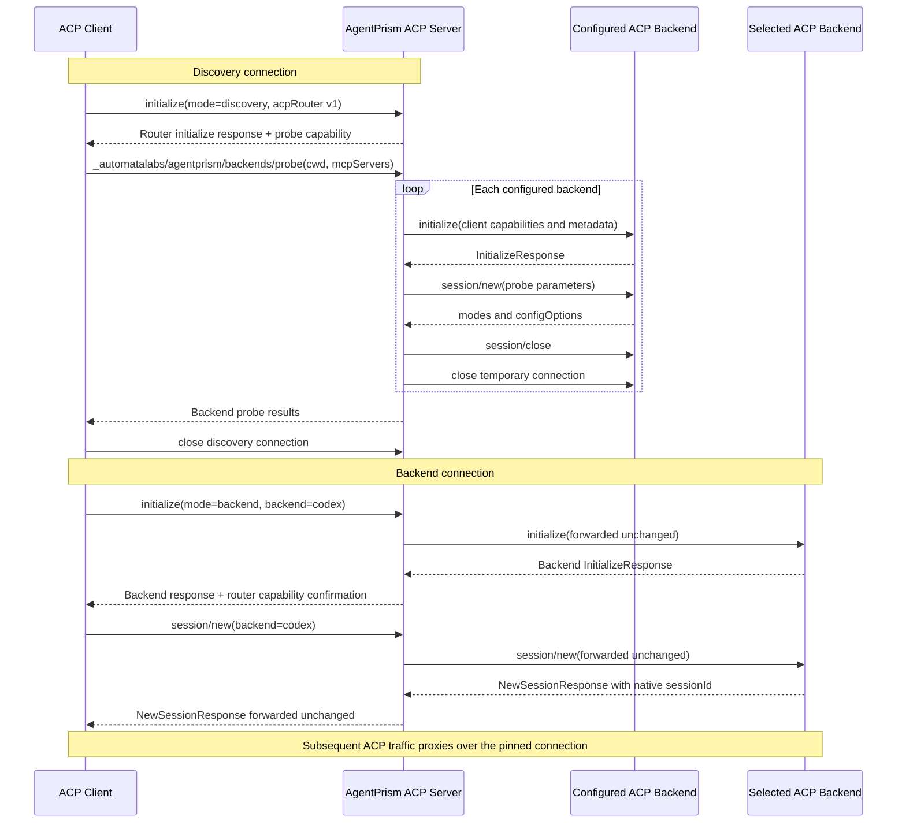

# AgentPrism ACP server implementation contract

**Status:** implemented · released as `@automatalabs/acp-server@0.1.0`

## Source request (verbatim)

> “The proposed feature is basically to be able to use acp-agents as an acp server that acp clients can connect to as a single server that aggregates and exposes the underlying servers as a single acp server”
>
> “Well, I think we should simply not support "orginary" acp clients. ACP clients have to negotiate the capability to interact with our server, or they just can't connect.”
>
> “Our proxy would specifically handle the out-of-spec methods we're implementing, and then on session/new, look at the custom _meta, route the request transparently to the right backend.”
>
> “We also don't need to strip _meta before forwarding, because the underlying server implementations are supposed to ignore _meta tags they don't care about.”
>
> “Okay then I agree with your design. Can you concisely save this design to a document?”
>
> “I don't understand why we need connectionId or principalId. I never asked you to handle auth, regardless of whether or not its a remote or stdio server. I also don't understand why we would need connectionId.”
>
> “Can you stop narrating hypothetical future work in the document and just strictly describe the implementation”
>
> “The doc is still confusing. It described session/new semantics, but not initialize....?”
>
> “The Connection-pinned transparent proxy implementation is what I was imagining.”
>
> “Backend discovery requires a separate initialized discovery connection:
>
> ```text
> initialize(router discovery mode)
> _backends/probe(cwd, mcpServers)
> close
>
> initialize(backend=codex)
> session/new
> ...
> ```”
>
> “I think this makes sense, although I don't understand why this is in the doc "Probe results do not expose commands, environment variables, credentials, or registry spawn configuration. Discovery connections reject session and prompt methods."
>
> Also, please add a mermaid diagram of the initialization and session setup process”

## Implementation

`@automatalabs/acp-server` is an ACP V1 stdio proxy exposed by the `agentprism-acp-server` executable. Each client connection operates in exactly one of two modes:

- **Discovery mode** probes the configured backends and returns their capabilities and session configuration.
- **Backend mode** pins the connection to one configured backend and transparently proxies ACP traffic to it.

The server does not run workflows, fan prompts out, combine model catalogs, rewrite session IDs, or maintain a session routing table.

## Initialization and session setup



## Router capability

Both connection modes require the client to advertise router extension version 1:

```json
{
  "protocolVersion": 1,
  "clientCapabilities": {
    "_meta": {
      "@automatalabs/agentprism": {
        "acpRouter": { "versions": [1] }
      }
    }
  }
}
```

The connection mode is selected in the initialize request's top-level `_meta`:

```json
{
  "_meta": {
    "@automatalabs/agentprism": {
      "acpRouter": {
        "version": 1,
        "mode": "discovery"
      }
    }
  }
}
```

or:

```json
{
  "_meta": {
    "@automatalabs/agentprism": {
      "acpRouter": {
        "version": 1,
        "mode": "backend",
        "backend": "codex"
      }
    }
  }
}
```

An unsupported ACP version, unsupported router version, missing mode, unknown mode, or unknown backend fails initialization and closes the connection.

## Discovery connection

In discovery mode, `initialize` terminates at the AgentPrism server. It returns the router's implementation information and advertises the probe method:

```json
{
  "protocolVersion": 1,
  "agentInfo": {
    "name": "agentprism-acp-server",
    "title": "AgentPrism ACP Server",
    "version": "<package version>"
  },
  "agentCapabilities": {
    "_meta": {
      "@automatalabs/agentprism": {
        "acpRouter": {
          "version": 1,
          "mode": "discovery",
          "methods": {
            "probeBackends": "_automatalabs/agentprism/backends/probe"
          }
        }
      }
    }
  }
}
```

The initialized client invokes `_automatalabs/agentprism/backends/probe` with the fields needed for temporary backend sessions:

```ts
interface ProbeBackendsParams {
  cwd: string;
  additionalDirectories?: string[];
  mcpServers: McpServer[];
  _meta?: Record<string, unknown> | null;
}
```

For each configured backend, the server:

1. opens a temporary downstream ACP connection;
2. forwards the discovery connection's complete initialize request unchanged;
3. sends `session/new` using the probe parameters;
4. records the backend's initialize capabilities and the session's modes and configuration options; and
5. closes the temporary session and downstream connection.

The probe returns every configured backend, including isolated failures:

```ts
type BackendProbe =
  | {
      id: string;
      name: string;
      available: true;
      agentInfo?: Implementation | null;
      agentCapabilities?: AgentCapabilities;
      modes?: SessionModeState | null;
      configOptions?: SessionConfigOption[] | null;
      initializeMeta?: Record<string, unknown> | null;
      sessionMeta?: Record<string, unknown> | null;
    }
  | {
      id: string;
      name: string;
      available: false;
      stage: "initialize" | "session/new";
      error: string;
    };

interface ProbeBackendsResult {
  backends: BackendProbe[];
}
```

A probe failure does not fail the discovery connection or omit other backends. Discovery mode exposes only `_automatalabs/agentprism/backends/probe`; session and prompt methods are unavailable because the connection has no selected backend.

## Backend connection initialization

In backend mode, the server resolves the requested backend, opens one downstream ACP connection, and forwards the complete initialize request unchanged. The selected backend therefore receives the client's actual protocol version, standard capabilities, implementation information, and `_meta`.

The server returns the backend's initialize response unchanged except for merging this confirmation into `agentCapabilities._meta`:

```json
{
  "@automatalabs/agentprism": {
    "acpRouter": {
      "version": 1,
      "mode": "backend",
      "backend": "codex"
    }
  }
}
```

The backend's protocol version, implementation information, standard capabilities, and all unrelated `_meta` remain unchanged. A downstream initialization error is returned to the client and closes both connections.

## Session creation

Every `session/new` request repeats the backend selection:

```json
{
  "cwd": "/project",
  "mcpServers": [],
  "_meta": {
    "@automatalabs/agentprism": {
      "acpRouter": {
        "version": 1,
        "backend": "codex"
      }
    }
  }
}
```

The server verifies that this backend matches the one selected during initialize and rejects a mismatch. It then forwards the complete request unchanged and returns the backend's response unchanged. The backend's session ID remains the client-visible session ID.

## Transparent proxy behavior

After `session/new`, AgentPrism routing metadata is not required. Every client request and notification is sent to the connection's selected backend. Every backend request and notification is sent to the connected client, and its response is returned to the backend.

The proxy preserves method names, parameters, results, errors, session IDs, request ordering, and `_meta`. AgentPrism owns only methods under `_automatalabs/agentprism/*`; other custom methods pass through unchanged. Forwarding is awaited so backend updates and client requests cannot be overtaken by the corresponding prompt response. Cancellation closes or cancels the corresponding operation on the opposite connection.

The proxy terminates the outer and downstream JSON-RPC connections, so each connection's SDK correlates its own request IDs. This transport correlation does not create application-level session state.

## Package boundary

`@automatalabs/acp-server` is a composition-root package with the `agentprism-acp-server` bin. It depends on `@automatalabs/acp-agents` and the ACP SDK and remains independent of the workflow engine and MCP server. `acp-agents` exposes a raw downstream ACP connection factory that provides backend resolution, process lifecycle, and bidirectional protocol access without passing through `AcpAgentRunner.run()` or its observational event bus.

The executable supports ACP V1 over stdio. Authentication, authorization, workspace policy, HTTP, WebSocket, and ACP V2 are outside the implementation.
