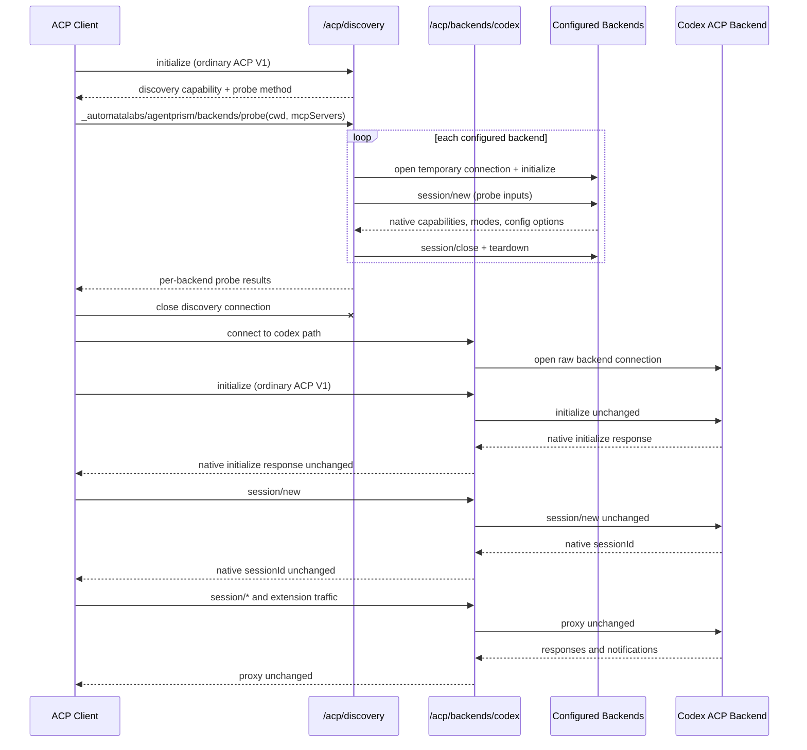

# AgentPrism ACP server implementation contract

**Status:** implemented · transport-boundary routing cutover unreleased

## Source request (verbatim)

> “The proposed feature is basically to be able to use acp-agents as an acp server that acp clients can connect to as a single server that aggregates and exposes the underlying servers as a single acp server”
>
> “Well, I think we should simply not support "orginary" acp clients. ACP clients have to negotiate the capability to interact with our server, or they just can't connect.”
>
> “Our proxy would specifically handle the out-of-spec methods we're implementing, and then on session/new, look at the custom _meta, route the request transparently to the right backend.”
>
> “We also don't need to strip _meta before forwarding, because the underlying server implementations are supposed to ignore _meta tags they don't care about.”
>
> “Okay then I agree with your design. Can you concisely save this design to a document?”
>
> “I don't understand why we need connectionId or principalId. I never asked you to handle auth, regardless of whether or not its a remote or stdio server. I also don't understand why we would need connectionId.”
>
> “Can you stop narrating hypothetical future work in the document and just strictly describe the implementation”
>
> “The doc is still confusing. It described session/new semantics, but not initialize....?”
>
> “The Connection-pinned transparent proxy implementation is what I was imagining.”
>
> “Backend discovery requires a separate initialized discovery connection:
>
> ```text
> initialize(router discovery mode)
> _backends/probe(cwd, mcpServers)
> close
>
> initialize(backend=codex)
> session/new
> ...
> ```”
>
> “I think this makes sense, although I don't understand why this is in the doc "Probe results do not expose commands, environment variables, credentials, or registry spawn configuration. Discovery connections reject session and prompt methods."
>
> Also, please add a mermaid diagram of the initialization and session setup process”
>
> “Okay the next task is to add an http/websocket mode to our acp-server so that clients that support websockets can connect. This may or may not involve experimental acp v2 support. If the examples use it, then we should too. The docs may incorrectly state that websocket/http or v2 support is not in scope, but they are incorrect and those lines should be omitted (not replaced).”
>
> “I'm talking specifically acp-server....? why are you bringing up other stuff”
>
> “Okay lets do that. Do a full cutover”

## Implementation

`@automatalabs/acp-server` aggregates the ACP backends configured by `acp-agents` and serves ACP V1
over stdio, Streamable HTTP, and WebSocket. The selected transport endpoint fixes the connection's
role before ACP `initialize`:

- A **discovery endpoint** probes the configured backend catalog.
- A **backend endpoint** pins the connection to exactly one configured backend and transparently
  proxies ACP traffic.

The server does not run workflows, fan prompts out, combine model catalogs, rewrite session IDs,
or maintain a session-routing table.

## Transport-boundary endpoint selection

### HTTP and WebSocket

One network listener exposes a route hierarchy under a configurable base path. The default routes
are:

```text
/acp/discovery
/acp/backends/claude
/acp/backends/codex
/acp/backends/opencode
/acp/backends/pi
/acp/backends/{custom-backend}
```

HTTP and WebSocket share those exact paths. Only configured backend IDs are mounted. Backend IDs
match `^[a-z][a-z0-9._-]*$`; this makes path identity canonical without decoding or normalization.
An unknown backend path, a trailing-slash variant, and the former single `/acp` endpoint return
`404`.

The listener command is:

```bash
agentprism-acp-server --http --host 127.0.0.1 --port 7331 --base-path /acp
```

The network listener uses the official TypeScript SDK's `AcpServer`, Node HTTP adapter, and
WebSocket upgrade adapter. Each mounted endpoint owns an independent SDK transport server whose
connection factory is already pinned to its endpoint role. Streamable HTTP's
`Acp-Connection-Id`, SSE correlation, and WebSocket framing remain transport-owned; they do not
create an AgentPrism session-routing table or alter backend-native session IDs.

### Stdio

Stdio has no URL, so process arguments select the endpoint before the process reads ACP input:

```bash
agentprism-acp-server --discovery
agentprism-acp-server --backend codex
agentprism-acp-server --backend team-agent
```

Exactly one of `--discovery` or `--backend <id>` is required in stdio mode. `--http` exposes the
whole route hierarchy and rejects either selector. An unknown stdio backend fails at startup.

All transports carry ACP protocol version 1. The SDK's experimental module labels describe its
network transport APIs, not a different negotiated protocol version.

## Initialization and session setup



## Discovery endpoint

The discovery endpoint accepts an ordinary ACP V1 initialize request. It does not require a client
capability advertisement or routing metadata. Its initialize response advertises:

```json
{
  "agentCapabilities": {
    "_meta": {
      "@automatalabs/agentprism": {
        "backendDiscovery": {
          "version": 1,
          "methods": {
            "probeBackends": "_automatalabs/agentprism/backends/probe"
          }
        }
      }
    }
  }
}
```

The probe method accepts:

```ts
interface ProbeBackendsParams {
  cwd: string;                         // absolute
  additionalDirectories?: string[];   // absolute
  mcpServers: McpServer[];
  _meta?: Record<string, unknown> | null;
}
```

The server opens one isolated temporary raw connection per configured backend. On each connection
it forwards the discovery initialize request, sends one `session/new` with the probe inputs,
captures the backend's native initialize capabilities plus session modes and configuration options,
then sends `session/close` and tears the connection down. Failure is reported per backend with the
stage (`initialize` or `session/new`) and the resulting error message. One failed backend does not
fail the complete probe.

The discovery connection handles the probe method itself. It never becomes an operational backend
connection.

## Backend endpoints

A backend endpoint accepts the same ordinary ACP V1 initialize request any direct backend accepts.
The endpoint opens its already selected `BackendTarget`, forwards initialize unchanged, validates
that the backend returned an ACP V1 initialize response, and returns that response unchanged.
AgentPrism does not add capability metadata to the backend response.

After initialize, every client request or notification is forwarded unchanged and every backend
response or notification is forwarded unchanged. This includes `session/new`, backend-native
session IDs, arbitrary `_meta`, and extension methods. Backend selection is not repeated in
`session/new`.

The selected backend process belongs to the outer transport connection. Closing or aborting that
connection closes the downstream connection. The server keeps no global `sessionId -> backend` or
connection-routing table.

## Backend catalog

`resolveBackendTargets()` uses the same configured namespace as `acp-agents`:

- built-ins: `claude`, `codex`, `opencode`, `pi`;
- operator registrations from `AGENTPRISM_BACKENDS`;
- programmatic registrations passed as `backends`;
- exact embedded/test `BackendTarget[]` passed as `targets`.

Programmatic registrations override environment registrations by ID. Built-ins remain first in
their canonical order, followed by custom IDs sorted lexically. Custom registry validation and
environment scoping remain owned by `acp-agents`.

## Public API

```ts
serveAcpServer({
  endpoint: { kind: "discovery" },
  stream?,
  backends?,
  targets?,
  version?,
  signal?,
});

serveAcpServer({
  endpoint: { kind: "backend", backendId: "codex" },
  stream?,
  backends?,
  targets?,
  version?,
  signal?,
});

const handle = await listenAcpHttpServer({
  host?,
  port?,
  basePath?,
  maxRequestBodyBytes?,
  backends?,
  targets?,
  version?,
  signal?,
});
```

The network handle exposes `host`, `port`, `basePath`, `discovery`, `backends`, `closed`, and
idempotent `close()`. Each endpoint descriptor has `path`, `url`, and `webSocketUrl`; backend
descriptors also have `backendId`. `acpDiscoveryPath(basePath?)` and
`acpBackendPath(backendId, basePath?)` construct the canonical paths.

## Removed routing contract

This is a full breaking cutover. The implementation contains no compatibility parser, alias, or
fallback for the former initialize-metadata router:

- `clientCapabilities._meta["@automatalabs/agentprism"].acpRouter` is not negotiated.
- initialize `_meta` does not select discovery or a backend.
- `session/new` does not repeat or assert backend selection.
- backend initialize responses are not merged with router confirmation metadata.
- `/acp` is not an operational network endpoint.
- stdio without `--discovery` or `--backend <id>` is not accepted.
- the CLI `--path` option and library `path` option are removed; `--base-path` and `basePath`
  configure the route hierarchy.
- the old router constants, parsers, assertion helper, and response-merge helper are not exported.
- the aggregator is no longer listed as one directly launchable ACP registry agent; concrete
  `codex-acp` and `pi-acp` agents remain listed.

Unknown `_meta` still passes through backend endpoints unchanged as required by transparent ACP
proxying, but it cannot affect transport-selected routing.

## Error and lifecycle semantics

- The first message on every connection must be an ACP V1 `initialize` request.
- Unsupported protocol versions and malformed discovery probe inputs return JSON-RPC invalid-params
  errors.
- Backend spawn or initialize failures return JSON-RPC internal errors on the selected connection.
- Backend EOF, transport EOF, cancellation, and explicit server shutdown close that connection's
  downstream process and release stream locks.
- Discovery probe failures remain per-backend result entries.
- Network path lookup occurs before an ACP SDK transport connection is created.
- `close()` stops the listener, closes every endpoint transport server, and terminates active
  WebSocket clients. The `closed` promise resolves or rejects with that same shutdown outcome.

## Security boundary

The server adds no authentication, tenant model, filesystem mediation, prompt authorization, or
permission policy. Custom backend configuration is trusted operator input. Per-backend secrets
belong in each custom backend's scoped `env` overlay rather than the ambient process environment.
A network deployment must place the listener behind the access controls required for the selected
agents.
